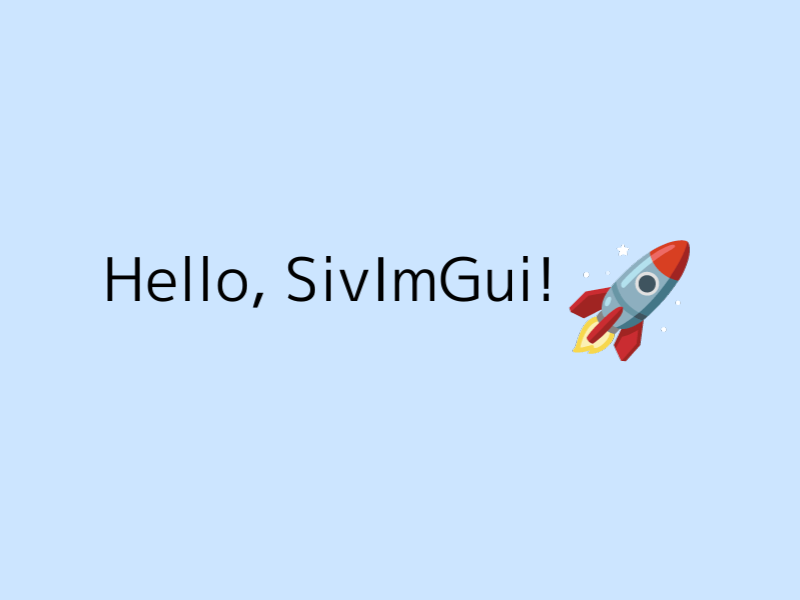

# SivImGui

`(Dear ImGui + egui + HTML) / 3`くらいのGUIライブラリ

## 実装例



### XML定義

**UI.xml**

```xml
<Container xExpand="true" yExpand="true">
    <HorizontalLayout horizontalAlignment="center" verticalAlignment="center">
        <Container>
            <HorizontalLayout>
                <Label textColor="black" font="asset:regular60">Hello, SivImGui!</Label>
                <Image>asset:rocket</Image>
            </HorizontalLayout>
        </Container>
    </HorizontalLayout>
</Container>
```

**Main.cpp**

```cpp
#include <Siv3D.hpp>
#include "GUI.hpp"

void Main()
{
	Scene::SetBackground(ColorF{ 0.8, 0.9, 1.0 });

	FontAsset::Register(U"regular60", 60);
	TextureAsset::Register(U"rocket", U"🚀"_emoji);

	// GUI環境を作成
	SivImGui::GUI gui(U"UI.xml", SivImGui::EnableHotReload::Yes);

	while (System::Update())
	{
		gui.setAvailableSize(Scene::Size());
		gui.update();
		gui.draw();
	}
}
```

### ループ内定義

```cpp
#include <Siv3D.hpp>
#include "GUI.hpp"
#include "Builder.hpp"
#include "Widgets/Container.hpp"
#include "Widgets/Label.hpp"
#include "Widgets/Image.hpp"

void Main()
{
	Scene::SetBackground(ColorF{ 0.8, 0.9, 1.0 });

	const Font font{ 60 };
	const Texture rocketTex(U"🚀"_emoji);

	// GUI環境を作成
	SivImGui::GUI gui(std::make_unique<SivImGui::Container>());

	// 横幅,縦幅を広げ、子要素を中央に配置
	auto& root = gui.rootWidget();
	root.xExpand = true;
	root.yExpand = true;
	root.layout = SivImGui::HorizontalLayout{
		.horizontalAlignment = SivImGui::Alignment::Center,
		.verticalAlignment = SivImGui::Alignment::Center
	};

	while (System::Update())
	{
		gui.setAvailableSize(Scene::Size());
		gui.update();

		{
			// 操作対象をrootに設定する
			SivImGui::Builder b(root);

			// この内部でUIを定義
			// ↓ ↓ ↓ ↓ ↓

			// コンテナの定義
			b.next<SivImGui::Container>()([&](SivImGui::Container& c) {
				// レイアウトの向きを水平に
				c.layout = SivImGui::HorizontalLayout{};

				// ラベル"Hello, SivImGui!"を定義
				auto& label = b.next<SivImGui::Label>()();
				label.text = U"Hello, SivImGui!";
				label.textColor = Palette::Black;
				label.font = font;

				// ロケットのテクスチャを定義
				auto& img = b.next<SivImGui::Image>()();
				img.texture = rocketTex;
			});

			// ↑ ↑ ↑ ↑ ↑
		}

		gui.draw();
	}
}
```

### 手動定義

```cpp
#include <Siv3D.hpp>
#include "GUI.hpp"
#include "Widgets/Container.hpp"
#include "Widgets/Label.hpp"
#include "Widgets/Image.hpp"

void Main()
{
	Scene::SetBackground(ColorF{ 0.8, 0.9, 1.0 });

	const Font font{ 60 };
	const Texture rocketTex(U"🚀"_emoji);

	// 親要素を作成
	auto root = std::make_unique<SivImGui::Container>();

	// 横幅,縦幅を広げ、子要素を中央に配置
	root->xExpand = true;
	root->yExpand = true;
	root->layout = SivImGui::HorizontalLayout{
		.horizontalAlignment = SivImGui::Alignment::Center,
		.verticalAlignment = SivImGui::Alignment::Center
	};

	{
		// コンテナを追加、レイアウトの向きを水平に
		auto container = std::make_unique<SivImGui::Container>();
		container->layout = SivImGui::HorizontalLayout{};
		{
			// ラベル"Hello, SivImGui!"を追加
			auto label = std::make_unique<SivImGui::Label>();
			label->text = U"Hello, SivImGui!";
			label->textColor = Palette::Black;
			label->font = font;
			container->addChild(std::move(label));

			// ロケットのテクスチャを追加
			auto image = std::make_unique<SivImGui::Image>();
			image->texture = rocketTex;
			container->addChild(std::move(image));
		}
		root->addChild(std::move(container));
	}

	// GUI環境を作成
	SivImGui::GUI gui(std::move(root));

	while (System::Update())
	{
		gui.setAvailableSize(Scene::Size());
		gui.update();
		gui.draw();
	}
}
```
